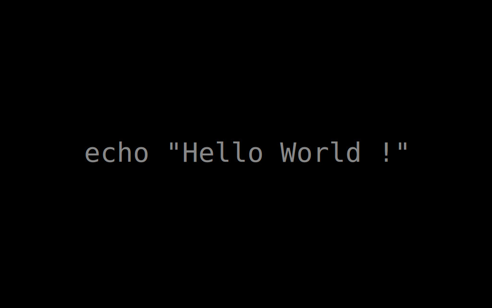

# Rodando o primeiro *container*



**Objetivo**:  
- conhecer os comandos básicos para o gerenciamento de um container Docker.


## 1. Executando a imagem hello-world

```bash
docker run --name hello hello-world
```
Documentação [**docker run**](https://docs.docker.com/engine/reference/commandline/run/).

## 2. Verificando os *containers* em execução
```bash
docker ps
```
Documentação [**docker ps**](https://docs.docker.com/engine/reference/commandline/ps/).

## 3. Verificando **TODOS** os *containers* em execução
```bash
docker ps -a
```

## 4. Verificando as imagens locais
```bash
docker images
```
Documentação [**docker images**](https://docs.docker.com/engine/reference/commandline/images/).

## 5. Removendo o container hello
```bash
docker rm hello
```
Documentação [**docker rm**](https://docs.docker.com/engine/reference/commandline/rm/).


## 6. Removendo a imagem hello-world
```bash
docker rmi hello-world
```
Documentação [**docker rmi**](https://docs.docker.com/engine/reference/commandline/rmi/).

## 7. Próximos passos

Acesse [aqui](02-nginx.md) a próxima atividade.

